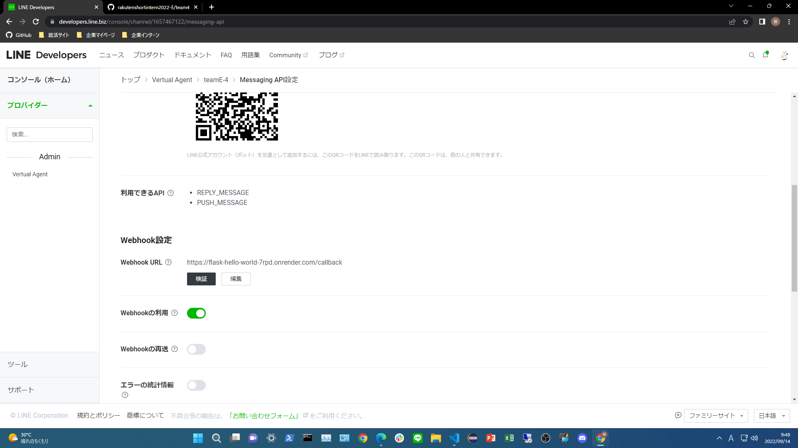

# mother-bot
this is a healing line bot for tired people.

## how to use

### Python version(maybe 3.7.10)
1. create a line bot account and get channel access token and channel secret.
2. create a server on Render
   1. select python as language
   2. set secret environment variables
      - YOUR_CHANNEL_ACCESS_TOKEN
      - YOUR_CHANNEL_SECRET
   3. set build command to `make setup`
   4. set run command to `gunicorn app:app`
3. set webhook url to your server url
   - ex) https://mother-go.onrender.com/callback
4. enable webhook in webhook settings

## Reference

- [LINE Messaging APIの仕様](https://developers.line.biz/ja/reference/messaging-api/)
- [flask deploy on render](https://render.com/docs/deploy-flask)
